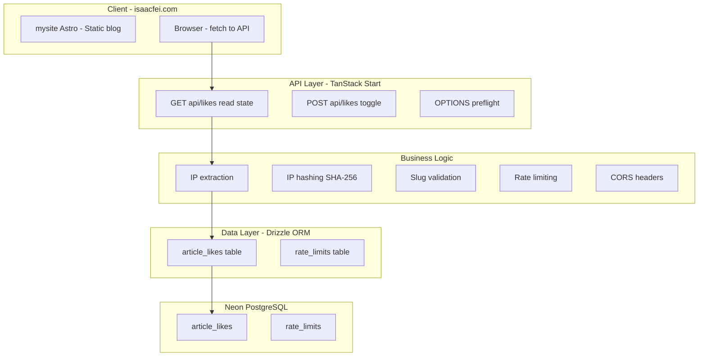
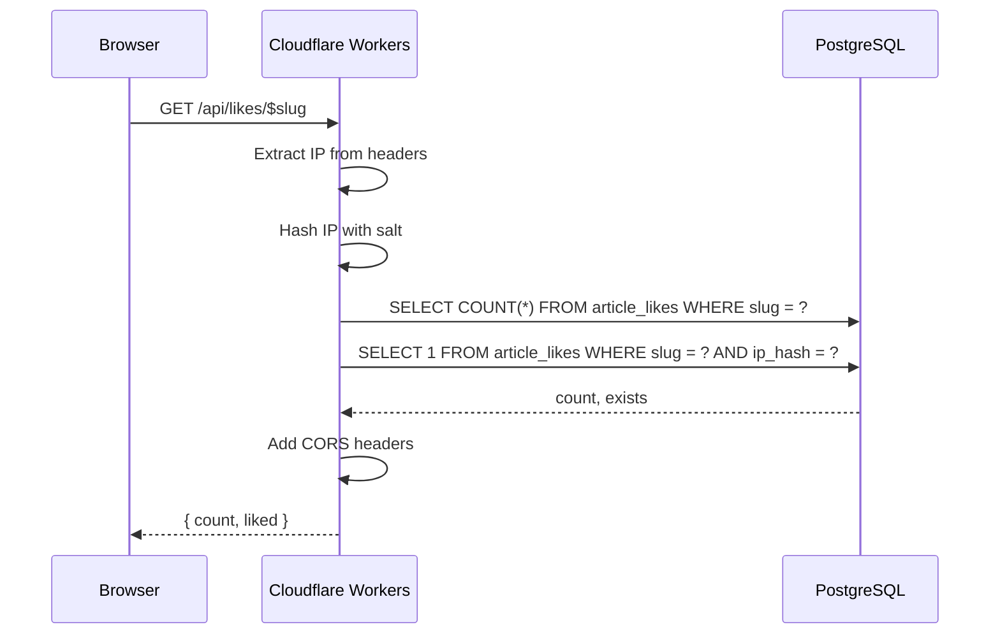
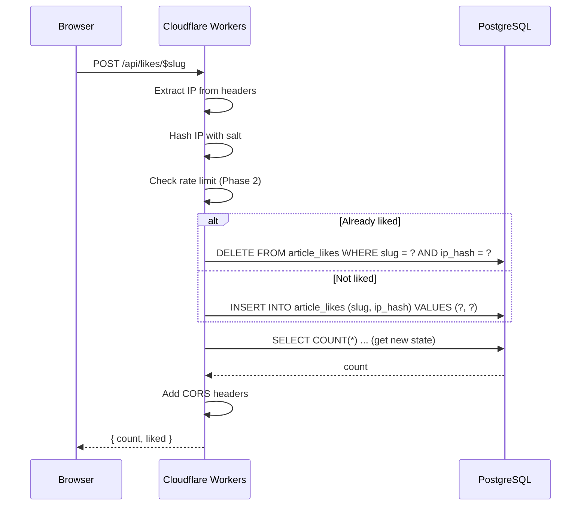

# Technical Design Document: Simple Like System

**Document ID:** TDD-SLS-001  
**Version:** 1.0  
**Status:** Draft  
**Last Updated:** 2025-03-19  
**Related PRD:** PRD-SLS-001  

---

## Revision History

| Version | Date       | Author | Changes       |
|---------|------------|--------|---------------|
| 1.0     | 2025-03-19 | —      | Initial draft |

---

## 1. Architecture Overview

### 1.1 System Context



### 1.2 Request Flow

**GET (Read Like State):**



**POST (Toggle Like):**



### 1.3 Technology Stack

| Component    | Technology                    |
|-------------|-------------------------------|
| Runtime     | Cloudflare Workers            |
| Framework   | TanStack Start                |
| ORM         | Drizzle ORM                   |
| Database    | Neon PostgreSQL (HTTP driver)  |
| Hashing     | Web Crypto API (SHA-256)      |

---

## 2. Data Model

### 2.1 Entity Relationship

```mermaid
erDiagram
    article_likes {
        text slug PK "NOT NULL"
        text ip_hash PK "NOT NULL"
        timestamptz created_at "NOT NULL, default now()"
    }
    note right of article_likes: UNIQUE(slug, ip_hash)
```

### 2.2 Table: `article_likes`

**Purpose:** Store one row per (article, user) like. Toggle unlike = delete row.

| Column     | Type                     | Nullable | Default | Description                                    |
|------------|--------------------------|----------|---------|------------------------------------------------|
| slug       | text                     | NO       | —       | Article identifier (e.g. `building-ai-apps-with-go`) |
| ip_hash    | text                     | NO       | —       | SHA-256 hex hash of `SALT:client_ip` (64 chars) |
| created_at | timestamp with time zone | NO       | now()   | When the like was recorded                     |

**Constraints:**
- `PRIMARY KEY (slug, ip_hash)` — enforces uniqueness; also serves as lookup index.
- Implicit: one like per (slug, ip_hash).

**Indexes:**
- Primary key on `(slug, ip_hash)` — covers both count-by-slug and lookup-by-slug-and-ip.
- Optional: `CREATE INDEX idx_article_likes_slug ON article_likes(slug)` if count queries need optimization (PK may suffice).

### 2.3 Drizzle Schema Definition

**File:** `src/server/db/schema/article-likes.ts`

```typescript
import { pgTable, text, timestamp, unique } from "drizzle-orm/pg-core";

export const articleLikesTable = pgTable(
  "article_likes",
  {
    slug: text("slug").notNull(),
    ipHash: text("ip_hash").notNull(),
    createdAt: timestamp("created_at", { withTimezone: true })
      .notNull()
      .defaultNow(),
  },
  (table) => [unique().on(table.slug, table.ipHash)]
);
```

### 2.4 Raw SQL Migration

**File:** `drizzle/XXXX_article_likes.sql` (generated by `drizzle-kit generate`)

```sql
CREATE TABLE IF NOT EXISTS "article_likes" (
  "slug" text NOT NULL,
  "ip_hash" text NOT NULL,
  "created_at" timestamp with time zone DEFAULT now() NOT NULL,
  CONSTRAINT "article_likes_slug_ip_hash_unique" UNIQUE("slug", "ip_hash")
);
```

### 2.5 Table: `rate_limits` (Phase 2)

**Purpose:** Track request counts per IP per time window for abuse prevention.

| Column        | Type    | Nullable | Description                                      |
|---------------|---------|----------|--------------------------------------------------|
| identifier    | text    | NO       | Hash of `ip + ":" + hour_iso` (e.g. `2025-03-19T14`) |
| request_count | integer | NO       | Number of POST requests in this window           |
| window_start  | timestamptz | NO   | Start of the rate limit window                  |

**Constraints:**
- `PRIMARY KEY (identifier)` or unique on `identifier`.

**Cleanup:** Truncate or delete rows where `window_start` is older than 1 hour. Can use pg_cron or application-level cleanup.

---

## 3. IP Hashing

### 3.1 Algorithm

- **Hash function:** SHA-256 (via Web Crypto API `crypto.subtle.digest`).
- **Input format:** `{SALT}:{client_ip}` (e.g. `abc123secret:203.0.113.42`).
- **Output format:** Hex-encoded string (64 characters).

### 3.2 Implementation Pseudocode

```typescript
async function hashIp(ip: string, salt: string): Promise<string> {
  const input = `${salt}:${ip}`;
  const encoder = new TextEncoder();
  const data = encoder.encode(input);
  const hashBuffer = await crypto.subtle.digest("SHA-256", data);
  const hashArray = Array.from(new Uint8Array(hashBuffer));
  return hashArray.map((b) => b.toString(16).padStart(2, "0")).join("");
}
```

### 3.3 Environment Variable

| Variable          | Required | Description                                      |
|-------------------|----------|--------------------------------------------------|
| `LIKE_SYSTEM_SALT`| Yes      | Random string (e.g. 32+ chars). Rotate if leaked. |

### 3.4 Salt Rotation

If the salt is compromised, generate a new salt and update the env. Existing `ip_hash` values will no longer match; effectively, all users are treated as new. Likes are not migrated.

---

## 4. IP Extraction

### 4.1 Header Priority (Cloudflare Workers)

1. `CF-Connecting-IP` — Cloudflare's authoritative client IP. **Use this when available.**
2. `X-Forwarded-For` — First IP in the comma-separated list (client).
3. `X-Real-IP` — Fallback used by some proxies.
4. If none present: treat as anonymous; do not process like (return 400 or 503).

### 4.2 Implementation

```typescript
function getClientIp(request: Request): string | null {
  return (
    request.headers.get("CF-Connecting-IP") ??
    request.headers.get("X-Forwarded-For")?.split(",")[0]?.trim() ??
    request.headers.get("X-Real-IP") ??
    null
  );
}
```

### 4.3 Edge Cases

| Scenario              | Behavior                                                |
|-----------------------|---------------------------------------------------------|
| IPv6 address          | Use as-is; hash includes full address.                  |
| Multiple X-Forwarded-For | Use first (leftmost) IP per convention.             |
| Missing IP            | Return 400 Bad Request or 503; do not proceed.          |

---

## 5. Slug Validation

### 5.1 Rules

| Rule   | Specification                                              |
|--------|-------------------------------------------------------------|
| Length | 1–200 characters                                            |
| Chars  | `[a-zA-Z0-9_-]+` (alphanumeric, underscore, hyphen only)     |
| Regex  | `^[a-zA-Z0-9_-]{1,200}$`                                    |

### 5.2 Implementation

```typescript
const SLUG_REGEX = /^[a-zA-Z0-9_-]{1,200}$/;

function isValidSlug(slug: string): boolean {
  return typeof slug === "string" && SLUG_REGEX.test(slug);
}
```

### 5.3 Rejection

Invalid slug → HTTP 400 with body:

```json
{
  "error": "invalid_slug",
  "message": "Slug must be 1-200 characters, alphanumeric, hyphen, or underscore only."
}
```

---

## 6. API Specification

### 6.1 Base URL

```
Production: https://playground.isaacfei.com
Development: http://localhost:3000 (or configured port)
```

### 6.2 Endpoint: GET `/api/likes/$slug`

**Purpose:** Retrieve like count and whether the current requester has liked.

**Method:** GET  
**Path parameter:** `slug` (string)

**Request headers:**
- None required. IP is derived from `CF-Connecting-IP` or fallbacks.

**Response 200 OK:**

```json
{
  "slug": "building-ai-apps-with-go",
  "count": 42,
  "liked": true
}
```

| Field  | Type    | Description                          |
|--------|---------|--------------------------------------|
| slug   | string  | Echo of the requested slug           |
| count  | number  | Total like count (non-negative int)  |
| liked  | boolean | Whether the requester has liked      |

**Error responses:**

| Status | Error Code      | Condition                          |
|--------|-----------------|-------------------------------------|
| 400    | invalid_slug    | Slug validation failed              |
| 400    | missing_client_ip | Could not determine client IP    |
| 429    | rate_limit_exceeded | GET rate limit exceeded (Phase 2) |
| 500    | internal_error  | Database or server error            |

---

### 6.3 Endpoint: POST `/api/likes/$slug`

**Purpose:** Toggle like state. If not liked → add. If liked → remove.

**Method:** POST  
**Path parameter:** `slug` (string)

**Request body:** None required. Optional `{}` or `Content-Type: application/json` with empty body.

**Response 200 OK:**

```json
{
  "slug": "building-ai-apps-with-go",
  "count": 43,
  "liked": true
}
```

`count` and `liked` reflect the state **after** the toggle.

**Error responses:**

| Status | Error Code      | Condition                          |
|--------|-----------------|-------------------------------------|
| 400    | invalid_slug    | Slug validation failed              |
| 400    | missing_client_ip | Could not determine client IP    |
| 429    | rate_limit_exceeded | POST rate limit exceeded        |
| 500    | internal_error  | Database or server error            |

---

### 6.4 Standard Error Response Format

All error responses use:

```json
{
  "error": "error_code",
  "message": "Human-readable description.",
  "retryAfter": 3600
}
```

`retryAfter` (seconds) is optional; present for 429 responses.

---

### 6.5 OPTIONS (CORS Preflight)

**Method:** OPTIONS  
**Path:** `/api/likes/$slug` or `/api/likes/*`

**Response 204 No Content** with headers:

```
Access-Control-Allow-Origin: <allowed origin>
Access-Control-Allow-Methods: GET, POST, OPTIONS
Access-Control-Allow-Headers: Content-Type
Access-Control-Max-Age: 86400
```

---

## 7. CORS Configuration

### 7.1 Allowed Origins

| Environment | Origins                                                                 |
|-------------|-------------------------------------------------------------------------|
| Production  | `https://isaacfei.com`, `https://www.isaacfei.com` (if used)            |
| Development | `http://localhost:4321`, `http://127.0.0.1:4321` (Astro default)        |

### 7.2 Origin Resolution

- Read `Origin` request header.
- If origin is in allowlist → set `Access-Control-Allow-Origin: {origin}` (reflect exact origin).
- If not in allowlist → do not set the header (browser will block).

### 7.3 Headers to Add to All Like API Responses

```
Access-Control-Allow-Origin: <matched origin or omit>
Access-Control-Allow-Methods: GET, POST, OPTIONS
Access-Control-Allow-Headers: Content-Type
Access-Control-Max-Age: 86400
```

### 7.4 Preflight Handling

- OPTIONS requests: return 204 with CORS headers, no body.
- Apply to `/api/likes/*` routes.

---

## 7.5 Demo Page

A demo page within the playground validates the like feature before blog integration. Same-origin with the API, so no CORS is required for the demo.

| Attribute | Value |
|-----------|-------|
| Route | `/like-demo` |
| Slug (API) | `playground-like-demo` |
| Purpose | Try like/unlike; verify API and UX |

The like button on this page calls `GET /api/likes/playground-like-demo` and `POST /api/likes/playground-like-demo`. Likes are scoped exclusively to this slug.

---

## 8. Rate Limiting (Phase 2)

### 8.1 Limits

| Operation | Limit              | Window   |
|-----------|--------------------|----------|
| POST      | 30 requests        | 1 hour   |
| GET       | 60 requests        | 1 minute |

### 8.2 Identifier

For POST: `hash(ip + ":" + date_trunc('hour', now())::text)`  
For GET: `hash(ip + ":" + date_trunc('minute', now())::text)`

Use same SHA-256 + salt approach; store in `rate_limits` or Cloudflare KV.

### 8.3 Algorithm

1. Compute identifier for current window.
2. Increment request count (or insert with count=1).
3. If count > threshold → return 429, include `Retry-After` header.
4. Otherwise proceed.

### 8.4 Cleanup

- Hourly job to delete/truncate expired windows.
- Or use TTL if using KV.

---

## 9. Error Handling

### 9.1 Error Types and HTTP Status

| Error Code           | HTTP Status | When                                      |
|----------------------|-------------|-------------------------------------------|
| invalid_slug         | 400         | Slug fails validation                     |
| missing_client_ip    | 400         | No IP in headers                          |
| rate_limit_exceeded  | 429         | Rate limit exceeded                       |
| internal_error       | 500         | Unhandled exception, DB error             |

### 9.2 Logging

- Log error type and slug (no IP).
- Do not log request body for POST (none expected).
- Use structured logging if available.

### 9.3 Client IP Missing

If `getClientIp` returns null, respond with 400:

```json
{
  "error": "missing_client_ip",
  "message": "Could not determine client IP. Like operations require a valid client IP."
}
```

---

## 10. Security Considerations

### 10.1 Threat Model

| Threat                    | Mitigation                                      |
|---------------------------|--------------------------------------------------|
| SQL injection              | Parameterized queries via Drizzle; slug validation |
| IP enumeration             | Only hashes stored; no raw IP exposure            |
| CORS bypass                | Strict origin allowlist; no wildcard             |
| Abuse / spam likes         | Rate limiting                                    |
| Salt compromise            | Rotate salt; document rotation procedure         |

### 10.2 Input Validation

- Slug: regex + length before any DB access.
- No user-controlled data in raw SQL.

### 10.3 Secrets

- `LIKE_SYSTEM_SALT` in environment only; never in code or logs.

---

## 11. Implementation Phases

### Phase 1: Core (MVP)

| # | Task | Details |
|---|------|---------|
| 1 | Create Drizzle schema | `article-likes.ts` with slug, ip_hash, created_at, unique(slug, ip_hash) |
| 2 | Generate migration | `pnpm drizzle-kit generate`; apply with `pnpm drizzle-kit migrate` |
| 3 | Export schema | Add `articleLikesTable` to `schema/index.ts` |
| 4 | IP hashing utility | `src/lib/likes/hash-ip.ts` — async SHA-256 with salt |
| 5 | IP extraction utility | `src/lib/likes/get-client-ip.ts` — CF-Connecting-IP, X-Forwarded-For, X-Real-IP |
| 6 | Slug validation | `src/lib/likes/validate-slug.ts` — regex, 1–200 chars |
| 7 | CORS helper | `src/lib/likes/cors.ts` — add headers, handle OPTIONS |
| 8 | GET handler | `src/routes/api/likes/$slug.ts` — count, liked, CORS |
| 9 | POST handler | Same file — toggle (insert/delete), return new state |
| 10 | Error handling | Consistent JSON error format |
| 11 | Env var | Document `LIKE_SYSTEM_SALT` in .env.example |
| 12 | Demo page | Route `/like-demo`, slug `playground-like-demo`, LikeButton component |
| 13 | Demo nav | Add to playground home demos list and sidebar nav |

### Phase 2: Hardening

| # | Task | Details |
|---|------|---------|
| 1 | Rate limit table/schema | `rate_limits` or KV design |
| 2 | Rate limit middleware/logic | Check before POST/GET; return 429 |
| 3 | Cleanup job | Hourly truncate/expire for rate_limits |
| 4 | Structured error logging | Error codes, slug; no IP |

### Phase 3: Frontend (mysite)

| # | Task | Details |
|---|------|---------|
| 1 | Like button component | Astro + client script or React island |
| 2 | Fetch on load | GET on mount; display count and liked state |
| 3 | Optimistic update | On click, update UI immediately; POST in background |
| 4 | Error/loading states | Disabled/skeleton while loading; toast on error |
| 5 | Integration | Add to blog post layout (meta bar or floating bar) |

---

## 12. File Structure

### 12.1 Playground (New/Modified Files)

```
external/playground/
├── src/
│   ├── lib/
│   │   └── likes/
│   │       ├── hash-ip.ts           # hashIp(ip, salt): Promise<string>
│   │       ├── get-client-ip.ts     # getClientIp(request): string | null
│   │       ├── validate-slug.ts    # isValidSlug(slug): boolean
│   │       ├── cors.ts             # withCorsHeaders(response, origin), handleOptions()
│   │       └── constants.ts        # DEMO_PAGE_SLUG = "playground-like-demo"
│   ├── routes/
│   │   ├── api/
│   │   │   └── likes/
│   │   │       └── $slug.ts        # createFileRoute, GET + POST handlers
│   │   └── _main/
│   │       └── like-demo/
│   │           └── index.tsx       # Demo page, slug = playground-like-demo
│   ├── features/
│   │   └── likes/
│   │       └── components/
│   │           └── LikeButton.tsx  # Reusable like button (used by demo + blog)
│   └── server/
│       └── db/
│           └── schema/
│               ├── article-likes.ts  # articleLikesTable
│               └── index.ts         # add export for articleLikesTable
├── drizzle/
│   └── XXXX_article_likes.sql       # migration (generated)
└── .env.example                     # add LIKE_SYSTEM_SALT
```

### 12.2 mysite (Phase 3)

```
mysite/
└── src/
    └── components/
        └── LikeButton.astro         # or LikeButton.tsx if using React
```

---

## 13. Testing Considerations

### 13.1 Unit Tests

- `hashIp`: same input → same output; different salt → different output.
- `isValidSlug`: valid slugs pass; invalid (empty, too long, special chars) fail.
- `getClientIp`: mock headers; verify priority order.

### 13.2 Integration Tests

- GET returns count and liked for new article (0, false).
- POST adds like; GET returns (1, true).
- POST again removes like; GET returns (0, false).
- Invalid slug → 400.
- Missing IP (mock) → 400.

### 13.3 E2E (Optional)

- Load demo page `/like-demo`; like button shows count; click toggles like.
- Load blog post; like button shows count.
- Click like; count increments, button shows liked state.
- Click again; count decrements, button shows unliked.

---

## 14. Deployment

### 14.1 Environment Variables

| Variable          | Required | Example                    |
|-------------------|----------|----------------------------|
| `DATABASE_URL`     | Yes      | (existing Neon URL)        |
| `LIKE_SYSTEM_SALT`| Yes      | 32+ char random string     |

### 14.2 Migration

Run before deploy:

```bash
pnpm drizzle-kit migrate
```

### 14.3 CORS Origins

Configure allowed origins per environment (e.g. via env or config).

---

## 15. Monitoring & Observability

### 15.1 Metrics (Optional)

- Request count by endpoint (GET vs POST).
- Error rate by error code.
- Latency p50, p95 for GET and POST.

### 15.2 Alerts (Optional)

- Error rate > threshold.
- Latency p95 > 500ms.

### 15.3 Logging

- Log errors with error code and slug (no IP).
- Avoid logging full request objects.

---

## 16. Known Limitations

| Limitation | Description | Acceptance |
|------------|-------------|------------|
| Shared IP | Users behind same NAT (school, office) share one identity | One like per IP per article; acceptable |
| Dynamic IP | User with changing IP can like multiple times | Acceptable for low-stakes engagement |
| VPN/Proxy | Different exit node = different IP = additional like possible | Acceptable |
| Salt rotation | Rotating salt invalidates all existing hashes | Documented; one-time reset |

---

## 17. Appendix: Request/Response Examples

### GET Success

**Request:**
```
GET /api/likes/building-ai-apps-with-go HTTP/1.1
Host: playground.isaacfei.com
Origin: https://isaacfei.com
```

**Response:**
```
HTTP/1.1 200 OK
Content-Type: application/json
Access-Control-Allow-Origin: https://isaacfei.com

{"slug":"building-ai-apps-with-go","count":42,"liked":true}
```

### POST Toggle (Add Like)

**Request:**
```
POST /api/likes/building-ai-apps-with-go HTTP/1.1
Host: playground.isaacfei.com
Origin: https://isaacfei.com
Content-Type: application/json
Content-Length: 2

{}
```

**Response:**
```
HTTP/1.1 200 OK
Content-Type: application/json
Access-Control-Allow-Origin: https://isaacfei.com

{"slug":"building-ai-apps-with-go","count":43,"liked":true}
```

### Error: Invalid Slug

**Response:**
```
HTTP/1.1 400 Bad Request
Content-Type: application/json

{"error":"invalid_slug","message":"Slug must be 1-200 characters, alphanumeric, hyphen, or underscore only."}
```

### Error: Rate Limit (Phase 2)

**Response:**
```
HTTP/1.1 429 Too Many Requests
Content-Type: application/json
Retry-After: 3600

{"error":"rate_limit_exceeded","message":"Too many requests. Please try again later.","retryAfter":3600}
```
